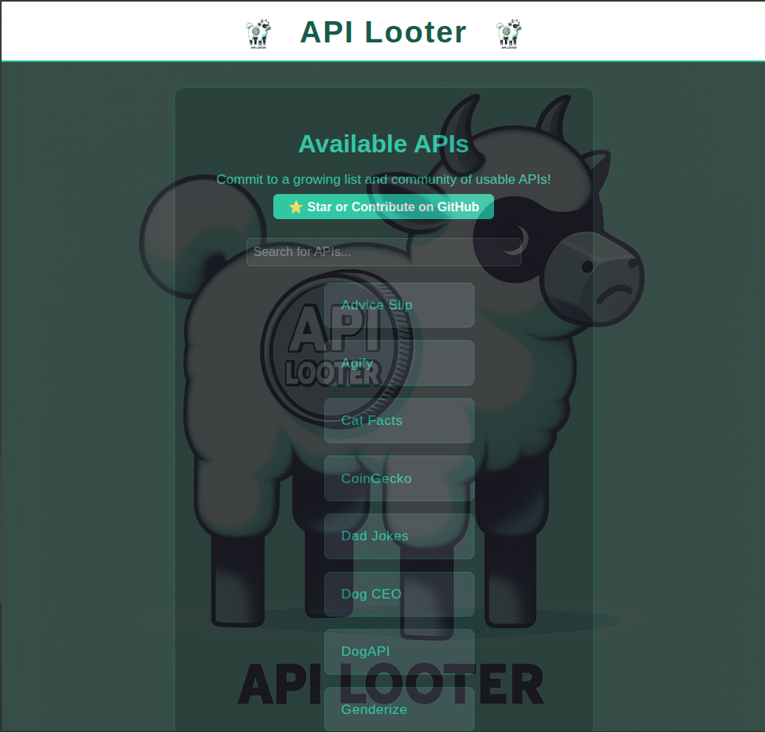
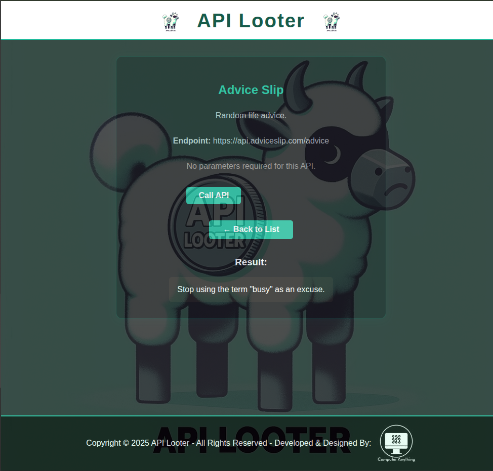
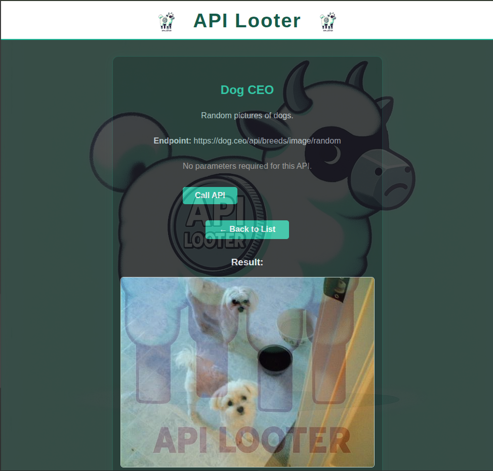

# 🚀 api_looter

## Overview

**api_looter** is an open-source developer tool that provides a curated list of free APIs.
Easily search, explore, and test APIs right from your browser! 🛠️🌐

---

## ✨ Features

- 🔍 **Searchable API Directory:** Find APIs fast with instant search.
- 📄 **Detailed API View:** See descriptions, endpoints, and required parameters.
- 🧪 **Live API Testing:** Fill out forms and make real API calls—see results instantly.
- 💡 **User-Friendly Interface:** Clean, responsive design for productivity.
- 🆓 **Open Source:** MIT licensed and ready for contributions!

---

## 🖼️ Screenshots


*Home page with searchable API directory*


*Detailed API view and live testing*


*Example API call to generate random dog photos*

---

## 🚦 Installation

1. **Clone the repository:**

    ```bash
    git clone https://github.com/Computer-Anything/api_looter.git
    ```

2. **Navigate to the project directory:**

    ```bash
    cd api_looter
    ```

3. **Install dependencies:**

    ```bash
    pip install -r requirements.txt
    ```

---

## ▶️ Usage

### Local Development (No Docker Needed!)

1. **Set up environment:**

    ```bash
    cp .env.development .env
    ```

2. **Run the application:**

    ```bash
    python run.py
    ```

3. **Open your browser:**
    Go to [http://localhost:8000](http://localhost:8000) to start exploring and testing APIs!

**That's it!** No database setup needed - all API data is stored in `app/data.py`.

---

## 🐳 Docker Setup (Staging/Production)

For production-like testing with Docker:

### Staging

1. **Set up environment:**
    ```bash
    cp .env.staging .env
    # Edit .env and fill in: SECRET_KEY, REDIS_PASSWORD, CLOUDFLARE_TUNNEL_TOKEN
    ```

2. **Build and run:**
    ```bash
    docker-compose -f docker-compose.staging.yml up --build
    ```

3. **Access the application:**
    Open your browser and go to [http://localhost:5000](http://localhost:5000)

### Production

1. **Set up environment:**
    ```bash
    cp .env.production .env
    # Edit .env and fill in production credentials
    ```

2. **Deploy:**
    ```bash
    docker-compose -f docker-compose.prod.yml up -d --build
    ```

See `docs/setup/PRODUCTION.md` for detailed deployment guide.

### Stop Containers

```bash
# Staging
docker-compose -f docker-compose.staging.yml down

# Production
docker-compose -f docker-compose.prod.yml down
```

---

## 🗂️ Environment Variables

This project uses environment-specific templates:

- `.env.development` - Local development (copy to `.env`)
- `.env.staging` - Staging deployment
- `.env.production` - Production deployment

**Required variables:**
- `SECRET_KEY` - Flask secret key
- `REDIS_URL` - Redis connection (`memory://` for dev, `redis://...` for production)
- `REDIS_PASSWORD` - Redis password (staging/production only)
- `CLOUDFLARE_TUNNEL_TOKEN` - Cloudflare tunnel token (staging/production only)
- `FLASK_ENV` - Environment name (`development`, `staging`, or `production`)

See `.env.development` for a complete example.

---

## ➕ Adding Your Own APIs

**Want to contribute an API? It's super easy!**

1. **Edit `app/data.py`** - Add your API to the `APIS` list:

```python
{
    "id": 15,  # Next available ID
    "name": "Your API Name",
    "description": "What this API does.",
    "endpoint": "https://api.example.com/v1/endpoint",
    "parameters": [],  # Add parameters if needed
    "why_use": "Why would a developer use this API?",
    "how_use": "How do developers commonly use this API?",
    "category": "Data",  # Images, Fun, Data, or Cryptocurrency
    "has_handler": False  # Set to True only if you need custom response parsing
},
```

2. **Validate:**
```bash
python validate_apis.py
```

3. **Test locally:**
```bash
python run.py
# Visit http://localhost:8000 and test your API
```

4. **Submit a PR!**

**The domain whitelist auto-updates** - no manual configuration needed!

See [CONTRIBUTING.md](docs/contributing/CONTRIBUTING.md) for detailed guide including custom handlers.

---

## 🤝 Contributing

Contributions, issues, and feature requests are welcome!
Feel free to [open an issue](https://github.com/Computer-Anything/api_looter/issues) or submit a pull request.

---

## 🧹 Code Quality

This project uses [ruff](https://docs.astral.sh/ruff/) for linting.
To check your code:

```bash
pip install ruff
ruff .
```

You can adjust which warnings are ignored in `pyproject.toml`.

---

## 🛠️ Technologies Used

- **Flask**: Web framework for Python.
- **PSQL**: Database for storing API data.
- **HTML/CSS**: For the frontend.
- **JavaScript**: For dynamic API testing.

## 📄 License

Licensed under the [MIT License](LICENSE).
Happy hacking! 💻✨
