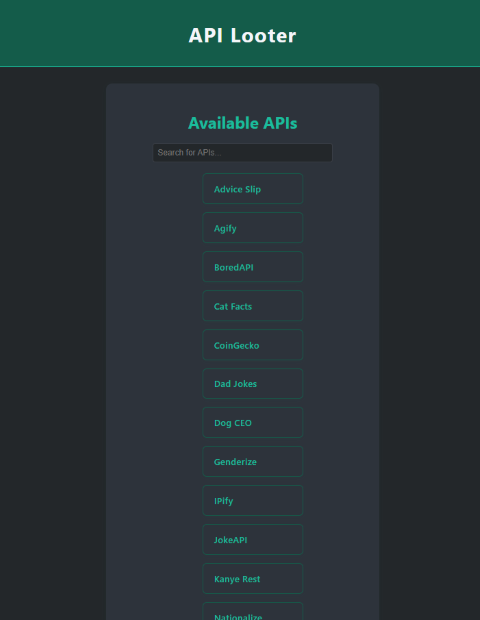
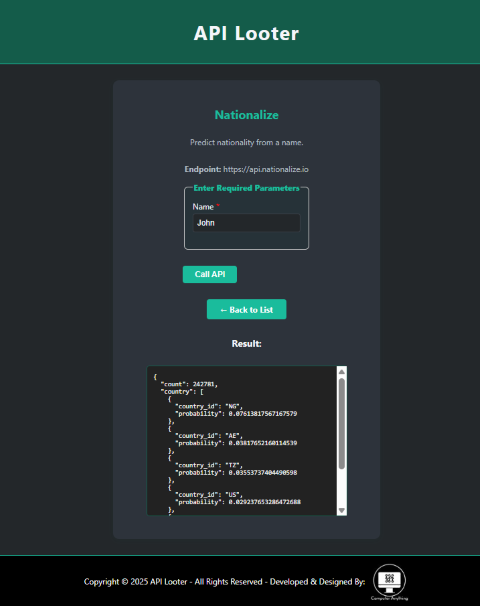

# 🚀 api_looter

## Overview

**api_looter** is an open-source developer tool that provides a curated list of free APIs.
Easily search, explore, and test APIs right from your browser! 🛠️🌐

---

## ✨ Features

- 🔍 **Searchable API Directory:** Find APIs fast with instant search.
- 📄 **Detailed API View:** See descriptions, endpoints, and required parameters.
- 🧪 **Live API Testing:** Fill out forms and make real API calls—see results instantly.
- 💡 **User-Friendly Interface:** Clean, responsive design for productivity.
- 🆓 **Open Source:** MIT licensed and ready for contributions!

---

## 🖼️ Screenshots


*Home page with searchable API directory*


*Detailed API view and live testing*

---

## 🚦 Installation

1. **Clone the repository:**

    ```bash
    git clone https://github.com/Computer-Anything/api_looter.git
    ```

2. **Navigate to the project directory:**

    ```bash
    cd api_looter
    ```

3. **Install dependencies:**

    ```bash
    pip install -r requirements.txt
    ```

---

## ▶️ Usage

1. **Set up the database:**

    ```bash
    python -m flask db init
    python -m flask db migrate
    python -m flask db upgrade
    ```

2. **Seed the database with sample data:**

    ```bash
    python -m app.seed
    ```

3. **Run the application:**

    ```bash
    flask run
    ```

4. **Open your browser:**
    Go to [http://127.0.0.1:5000](http://127.0.0.1:5000) to start adding and testing some API's api_looter!

---

## 🐳 Docker Compose Setup

If you prefer to run the application using Docker, you can use the provided `docker-compose.yml` file.

1. **Build and run the Docker containers:**

    ```bash
    docker-compose up --build
    ```

2. **Access the application:**
    Open your browser and go to [http://localhost:5000](http://localhost:5000).
3. **Stop the containers:**
    To stop the containers, press `Ctrl + C` in the terminal where you ran the `docker-compose` command.
4. **Remove the containers:**
    If you want to remove the containers and free up resources, run:

    ```bash
    docker-compose down
    ```
5. **Access the database:**
    You can access the PostgreSQL database using a database client like pgAdmin or DBeaver.
    The connection details are as follows:
    - Host: `db`
    - Port: `5432`
    - Database: `api_looter`
    - User: `postgres`
    - Password: `password`

---

## ➕ Adding Your Own APIs

To add a new API, simply add an `APIModel` entry to the `apis` list in [`app/seed.py`](app/seed.py).
**No code changes are needed for most APIs!**

**Example:**

```python
APIModel(
    name="My Cool API",
    description="Does something awesome.",
    endpoint="https://api.example.com/endpoint",
    parameters=[
        {"name": "param1", "label": "Parameter 1", "type": "text", "required": True}
    ]
),
```

**Advanced:**
If your API returns data in a very unique way and you want to customize how the response is displayed, you can add a helper function in [`app/api_helpers.py`](app/api_helpers.py).
*This is optional and only needed for special cases!*

---

For most APIs, just editing `seed.py` is all you need.

## 🤝 Contributing

Contributions, issues, and feature requests are welcome!
Feel free to [open an issue](https://github.com/Computer-Anything/api_looter/issues) or submit a pull request.

---

## 🧹 Code Quality

This project uses [ruff](https://docs.astral.sh/ruff/) for linting.
To check your code:

```bash
pip install ruff
ruff .
```

You can adjust which warnings are ignored in `pyproject.toml`.

---

## 🛠️ Technologies Used

- **Flask**: Web framework for Python.
- **PSQL**: Database for storing API data.
- **HTML/CSS**: For the frontend.
- **JavaScript**: For dynamic API testing.

## 📄 License

Licensed under the [MIT License](LICENSE).
Happy hacking! 💻✨
